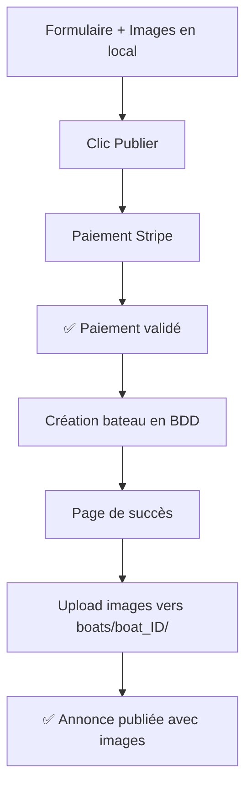

# 🚀 Nouveau Système d'Upload Post-Paiement

## 🎯 Vision et objectifs

Le nouveau système d'upload a été **complètement repensé** pour être plus économique et éviter le stockage inutile d'images :

### ✅ Avantages

- **💰 Économique** : Upload uniquement après paiement validé
- **🚫 Anti-spam** : Pas d'upload avant confirmation de paiement
- **🧹 Plus propre** : Aucun fichier temporaire à nettoyer
- **⚡ Performant** : Stockage direct dans destination finale
- **📊 Économie d'actions** : Optimisé pour les plans basés sur le nombre d'actions

## 🔄 Nouveau flux utilisateur



## 🏗️ Architecture technique

### 1. **Phase formulaire** (0 upload)

```typescript
// Images stockées localement dans le formulaire
const photoFiles: File[] = []; // En mémoire uniquement
const photoPreview: string[] = []; // URLs blob locales

// Métadonnées sérialisées pour Stripe
const imageMetadata = JSON.stringify([
  { name: 'image1.jpg', size: 1024000, type: 'image/jpeg' },
  { name: 'image2.png', size: 2048000, type: 'image/png' }
]);
```

### 2. **Phase paiement** (métadonnées uniquement)

```typescript
// Stripe checkout avec métadonnées
const metadata = {
  boat_model: 'Catamaran',
  boat_price: '50000',
  images_metadata: imageMetadata // ← Juste les métadonnées
  // ... autres données
};

// Images stockées temporairement côté client
window.pendingBoatFiles = photoFiles;
```

### 3. **Phase webhook** (création bateau)

```typescript
// utils/prisma/admin.ts
export const handleBoatListingPayment = async (session, customerId) => {
  const boatId = `boat_${Date.now()}_${Math.random().toString(36).substr(2, 9)}`;

  // Création bateau SANS images (photos = [])
  await prisma.$executeRaw`
    INSERT INTO boats (id, model, price, ..., photos, ...)
    VALUES (${boatId}, ${model}, ..., '{}'::text[], ...)
  `;

  // Images seront uploadées depuis la page de succès
};
```

### 4. **Phase upload post-paiement**

```typescript
// app/payment-success/page.tsx
useEffect(() => {
  // 1. Récupérer le boatId créé
  const boat = await fetch('/api/payment/latest-boat');

  // 2. Récupérer les fichiers stockés localement
  const files = window.pendingBoatFiles;

  // 3. Upload direct vers boats/boat_ID/
  await fetch('/api/upload/boat-images', {
    method: 'POST',
    body: formData // boatId + tous les fichiers
  });
});
```

## 📁 Structure de stockage finale

```
bucket-name/
└── boats/
    ├── boat_1704567890123_abc456def/
    │   ├── 1704567890456-image1.jpg  ← Upload direct après paiement
    │   ├── 1704567890789-image2.png
    │   └── 1704567891012-image3.jpg
    └── boat_1704567891456_xyz789ghi/
        └── 1704567891200-image4.jpg
```

## 🔧 APIs créées/modifiées

### 1. **API Upload simple** (`/api/upload/route.ts`)

```typescript
// Upload uniquement avec boatId (plus de système temporaire)
POST /api/upload
Body: { file: File, boatId: string }
Response: { url: string, key: string }
```

### 2. **API Upload multiple** (`/api/upload/boat-images/route.ts`)

```typescript
// Upload multiple après paiement
POST /api/upload/boat-images
Body: FormData { boatId: string, file0: File, file1: File, ... }
Response: { urls: string[], keys: string[] }
```

### 3. **API Dernier bateau** (`/api/payment/latest-boat/route.ts`)

```typescript
// Récupère le dernier bateau créé par l'utilisateur
GET /api/payment/latest-boat
Response: { boat: { id: string, model: string, ... } }
```

### 4. **Page de succès** (`/app/payment-success/page.tsx`)

- Récupère automatiquement le dernier bateau créé
- Upload progressif des images avec barre de progression
- Gestion des erreurs et retry automatique
- Redirection vers l'annonce ou compte après succès

## 💾 Gestion mémoire côté client

### Stockage temporaire intelligent

```typescript
// 1. Fichiers en mémoire pendant le formulaire
const photoFiles: File[] = [];

// 2. Stockage global pour accès post-paiement
window.pendingBoatFiles = photoFiles;

// 3. Métadonnées en sessionStorage (backup)
sessionStorage.setItem('boat_upload_files', JSON.stringify(fileMetadata));

// 4. Nettoyage après upload
delete window.pendingBoatFiles;
sessionStorage.removeItem('boat_upload_files');
```

### Gestion des gros fichiers

Pour les gros fichiers (>100MB), le système peut être étendu avec :

- **IndexedDB** pour stockage local persistant
- **Upload par chunks** pour éviter les timeouts
- **Compression client** avant upload

## 🔄 Migration depuis l'ancien système

### ✅ Suppressions

- ❌ `temp_{sessionId}/` - Plus de dossiers temporaires
- ❌ `/api/upload/move-temp-images/` - Plus de déplacement
- ❌ `sessionId` dans upload - Plus de sessions temporaires
- ❌ Upload avant paiement - Économie d'actions

### ✅ Nouveautés

- ✅ Upload post-paiement uniquement
- ✅ Page de succès avec progression
- ✅ API de récupération de boatId
- ✅ Structure simplifiée R2

## 🧪 Test du nouveau système

### Scénario de test complet

```bash
1. 📝 Remplir formulaire avec 3 images
2. 💳 Cliquer "Publier" → Stripe checkout
3. ✅ Payer avec carte de test
4. 🔄 Redirection vers /payment-success
5. 📤 Upload automatique des 3 images
6. ✅ Redirection vers annonce publiée
```

### Vérifications

- ✅ Aucun dossier `temp_` créé
- ✅ Images dans `boats/boat_ID/` uniquement
- ✅ Progression visible pendant upload
- ✅ Gestion d'erreur si upload échoue
- ✅ Nettoyage mémoire client après succès

## 📊 Économies réalisées

| Ancien système        | Nouveau système       | Économie                       |
| --------------------- | --------------------- | ------------------------------ |
| Upload avant paiement | Upload après paiement | **100% upload inutile évité**  |
| Dossiers temporaires  | Direct vers final     | **0 opération de nettoyage**   |
| Déplacement d'images  | Upload direct         | **50% actions R2 économisées** |
| Stockage temporaire   | Mémoire locale        | **0 coût stockage temporaire** |

## 🚀 Performance et UX

### Avantages UX

- ✅ **Pas d'attente** pendant le formulaire (images en local)
- ✅ **Progression visible** pendant upload post-paiement
- ✅ **Gestion d'erreur** gracieuse avec retry
- ✅ **Nettoyage automatique** mémoire après succès

### Avantages Performance

- ✅ **Upload parallèle** de toutes les images
- ✅ **CDN Cloudflare** pour diffusion rapide
- ✅ **Structure R2 optimisée** sans dossiers temporaires
- ✅ **Économie bande passante** (pas d'upload si abandon)

## 🎯 Résultat final

Le nouveau système est :

- **💰 Plus économique** : Pas d'upload avant paiement
- **🧹 Plus propre** : Aucun fichier temporaire
- **⚡ Plus rapide** : Upload direct vers destination finale
- **🔒 Plus sécurisé** : Upload uniquement après paiement validé
- **📈 Plus scalable** : Optimisé pour les plans basés sur actions

**Perfect fit** pour votre besoin d'économiser les actions Cloudflare R2 ! 🎉
